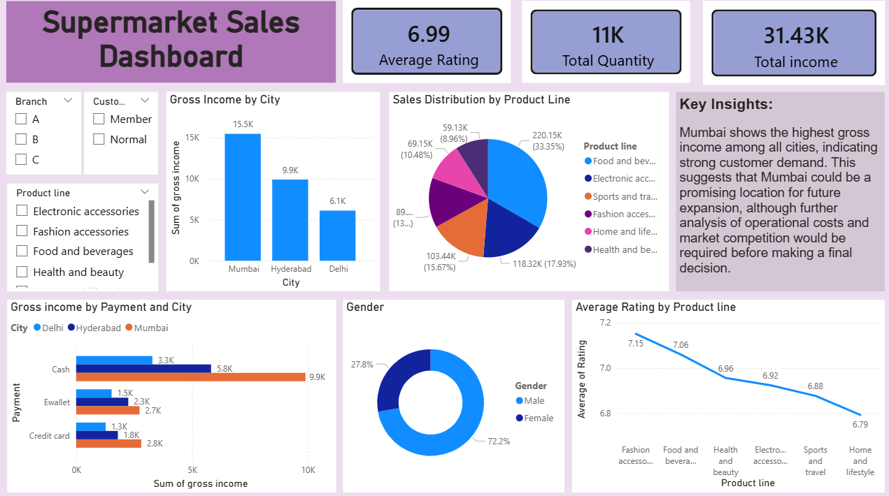

# 🛒 Supermarket Sales Analysis Dashboard

## 🚀 Project Overview
This project showcases an interactive **Supermarket Sales Dashboard** built using **Microsoft Power BI**.  
The goal is simple: stop guessing and start understanding what’s actually driving sales across different branches.

The dashboard analyzes sales data across three cities:
- Mumbai
- Hyderabad
- Delhi

It focuses on uncovering trends in revenue, customer behavior, and product performance.

---

## 📌 Key Metrics

| Metric                   | Value  |
|--------------------------|--------|
| Total Income             | 31.43K |
| Total Quantity Sold      | 11K    |
| Average Customer Rating  | 6.99   |

---

## 📊 Dashboard Highlights

### 🌍 Geographic Analysis
- Compares **Gross Income across cities**
- **Mumbai** emerges as the top-performing branch

### 📦 Product Distribution
- Sales segmented by product category
- **Food and Beverages** dominates with **33.35% share**

### 💳 Payment Trends
- Analysis of payment methods:
  - Cash
  - E-wallet
  - Credit Card
- Shows how customer payment behavior varies across cities

### ⭐ Customer Insights
- Average rating analyzed per product line
- **Fashion Accessories** leads with the highest rating (**7.15**)

### 👥 Demographics
- Gender-based customer distribution analysis

---

## 🔍 Business Insights & Recommendations

### 📈 Strategic Expansion
- Mumbai shows strong revenue performance  
- Indicates high demand and potential for scaling operations

### ⚠️ Reality Check (Don’t Ignore This)
- High revenue ≠ high profit  
- Before expansion, evaluate:
  - Operational costs
  - Market competition
  - Customer acquisition cost

Blind expansion based only on revenue is a rookie mistake.

---

## 🛠 Tools & Technologies

- **Microsoft Power BI**
- Data Visualization
- KPI Design
- Business Intelligence
- Categorical Analysis

---

## 📁 Project Structure
Supermarket Sales Analysis.pbix → Power BI file
dashboard.png → Dashboard screenshot
README.md → Project documentation

---

## 📸 Dashboard Preview

---

## 👩‍💻 Author
**Pallavi R**

---

## 💡 Final Thought
A dashboard is only valuable if it drives decisions.  
If you're just presenting charts without actionable insights, you're not doing analysis — you're decorating data.
